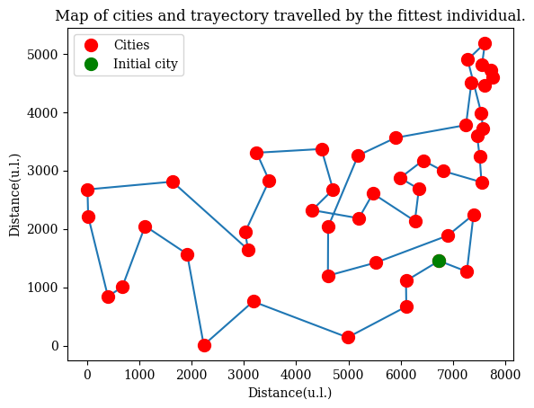
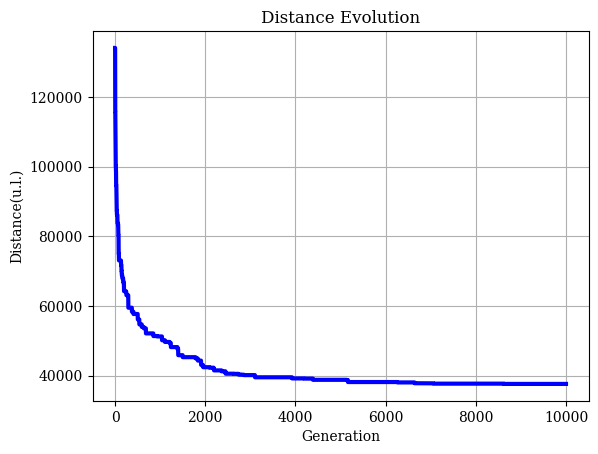

# TSP-with-Genetic-Algorithms
An approach for an optimal solution of the Traveling Salesman Problem (TSP)

## Content
- Main Code
  - mainTSP: Python file ready to execute the models.
  - GeneticTravelModel: Contains the algorithm and model functions.
  - exampleTSP: Jupyter notebook with examples.
 
- Data Sets
  - 15 Cities
  - 48 Cities

- Guides in PDF
  - theoryTSP: Main presentation with the function of each model.
  - examplesTSP: Jupyter notebook as PDF file.

## Example by Genetic Model 03 for 48 Cities.
**More info at theoryTSP PDF file**

This took 105.9s Although it could be faster with different parameters input. 

Fittest Trayectory of the last generation.

Convergence of traveled distance.

